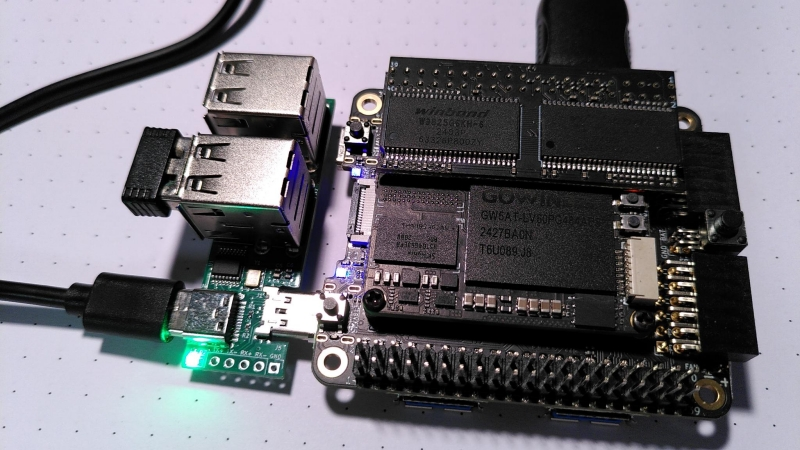
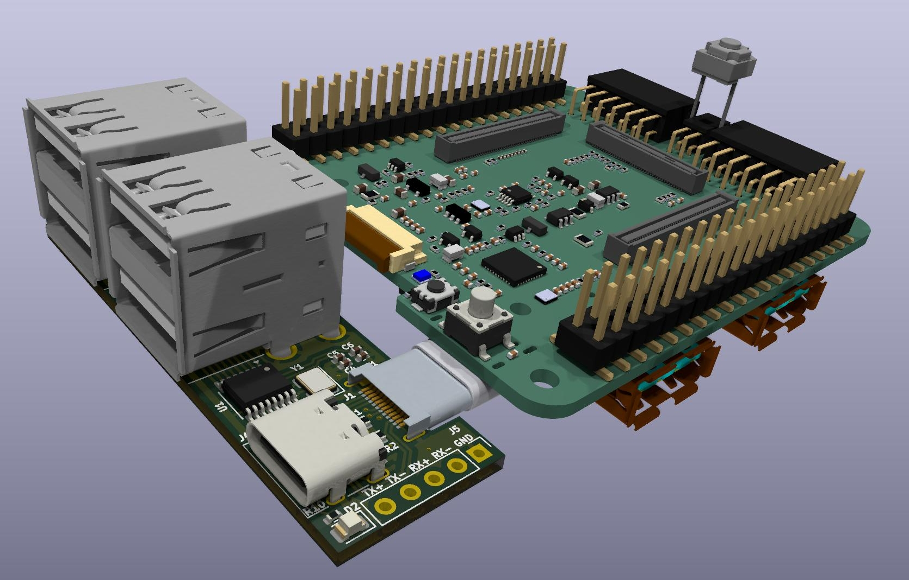
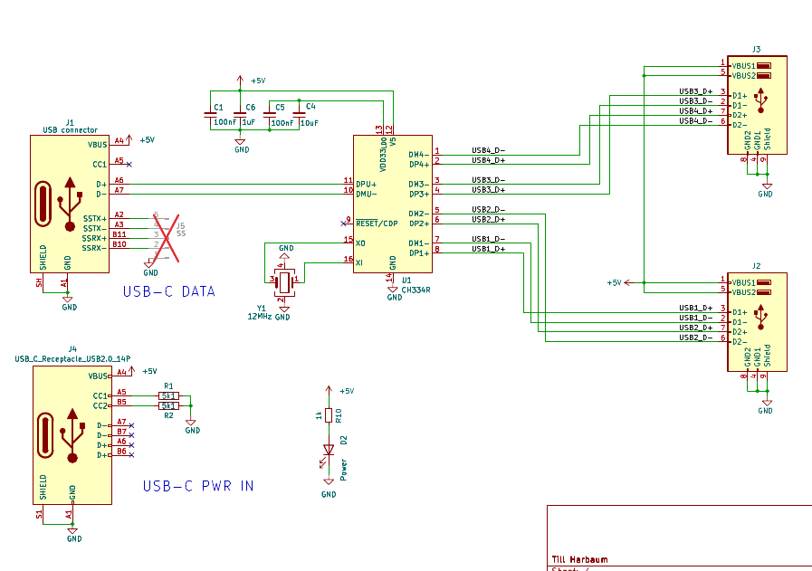
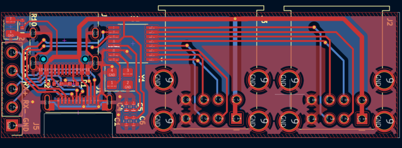
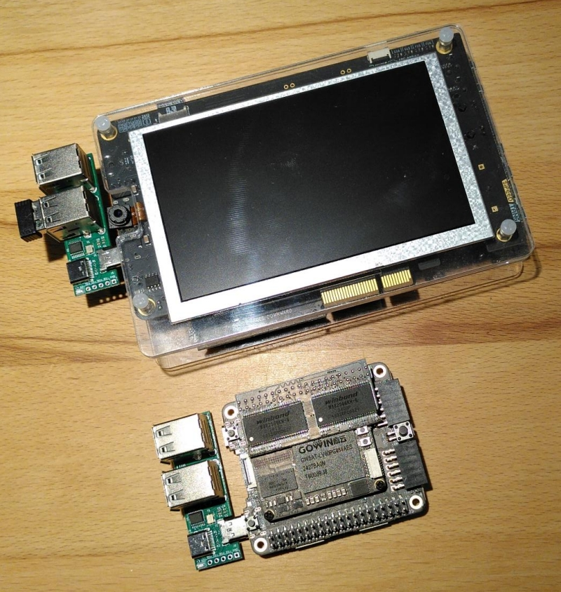

# Console USB Hub

The Tang Console as well as some other Tang Boards need to
be powered via the same USB port that may be used to attach
a USB Hub to e.g. connect keyboards, mice and gamepads for
use in MiSTle retro projects.

This board implements a 4 port USB 2.0 hub and can simultaneously act
as a USB power source to the board. It comes with a USB-C plug and
connects directly to the console to fit nicely along its side without
protruding too much. A USB receptacle allows to power the console
through the Hub.

The board can be manufactured at JLCPCB using the [production data](production).

[Schematic PDF](usbhub_sch.pdf)

Although being designed for the console, the hub also integrates
nicely with the Tang Mega series of boards. Unfortunately it covers the
12V barrel jack there, so the board needs to be powered via
USB through the Hub.

