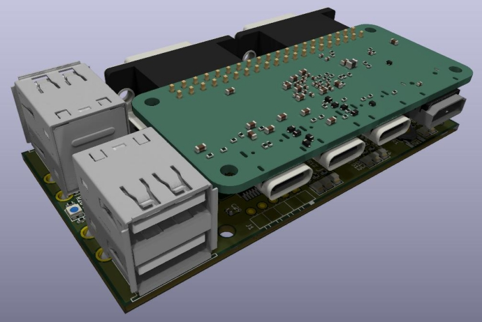
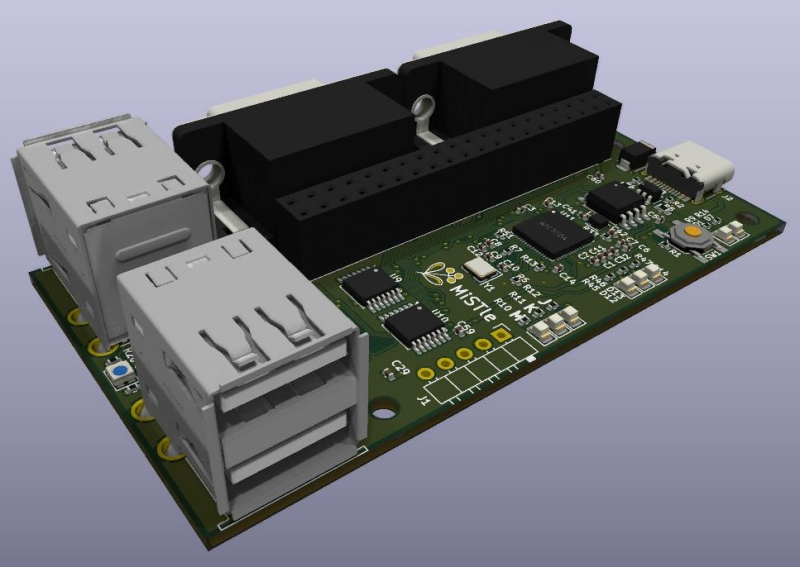
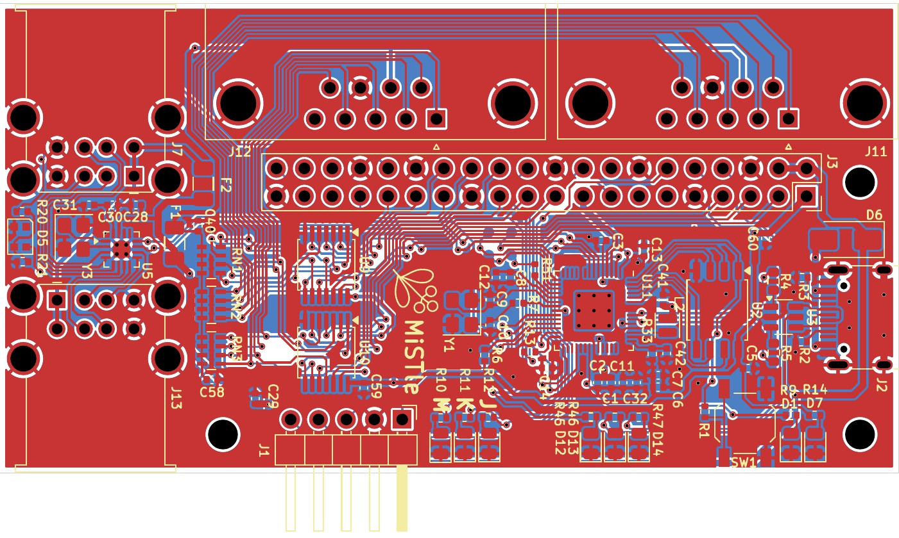

# MiSTle Icepi Carrier

This is a carrier/base board for the [Icepi-Zero](https://github.com/cheyao/icepi-zero).
It adds the FPGA Companion with its USB ports and two classic Dsub9 joystick ports.

See the [schematics](icepi_carrier_sch.pdf) and the [board layout](icepi_carrier_pcb.pdf).

## Production

This board can be manfactured through [JLCPCBs assembly service](http://jlcpcb.com) using the [production data](production).
