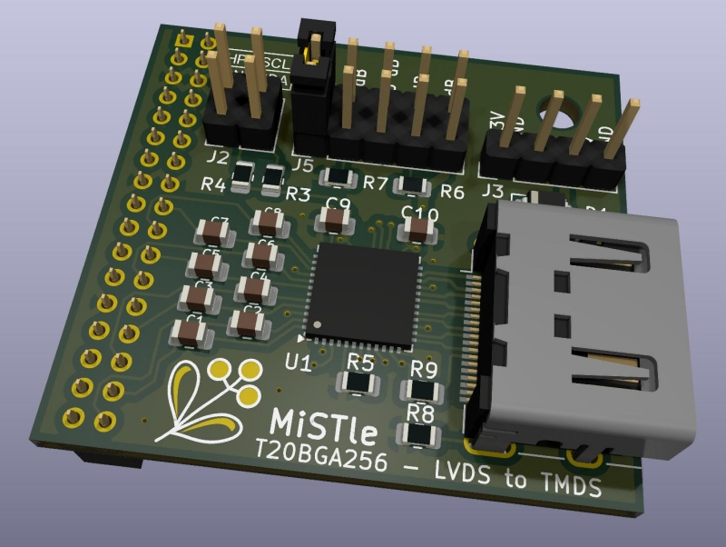

# LVDS2TMDS

The Trion T20 FPGA used on the [Efinix T20BGA256 development
board](https://www.efinixinc.com/products-devkits-triont20.html) has
certain limitations which prevent it from directly driving a
DVI/HDMI/TMDS signal. This board plugs into the LVDS transmitter port
of that board and does the electrical conversion to TMDS.

Unlike other solutions used with Trion FPGAs this does not
do any logical translation and the signals to be fed into this
board need to have the timing required for video transmission.

[Schematic PDF](lvds2tmds_sch.pdf)
[Layout PDF](lvds2tmds_board.pdf)	

