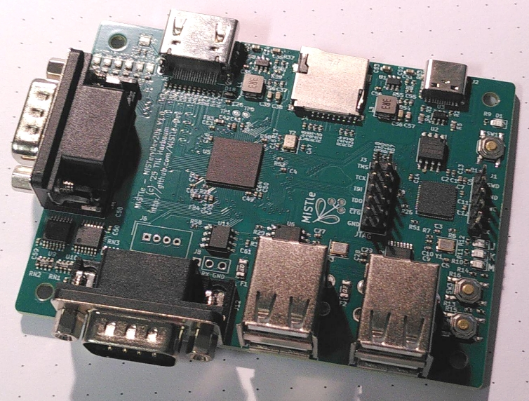

# MiSTeryDev20k

This is a work-in-progress and it will be the first prototype of a
complete custom board which will *not* be needing daughter boards
like the [Tang Nano 20k](https://wiki.sipeed.com/hardware/en/tang/tang-nano-20k/nano-20k.html) or
the [Raspberry Pi Pico](https://www.raspberrypi.com/documentation/microcontrollers/pico-series.html).

The board features the [Gowin GW2AR-LV18QN88C8/I7](https://www.gowinsemi.com/en/product/detail/38/) FPGA present on the
Tang Nano 20k and will run the same cores as that device including the
[NanoMig](http://github.com/MiSTle-Dev/NanoMig) and [MisteryNano](http://github.com/MiSTle-Dev/MiSTeryNano).

This board can be manfactured through [JLCPCBs assembly service](http://jlcpcb.com) using the [production data](production).


The main objective of this board is to run known-good cores and
firmware and test a few features that couldn't be implemented and
tested with the Tang Nano 20k. These include:

  - Use the RP2040 for JTAG programming of the FPGA :heavy_check_mark:
    - Using openFPGAloader :heavy_check_mark:
    - Using Gowin Graphical Programmer :heavy_check_mark:
    - Using Gowin Programmer CLI :heavy_check_mark:
    - Extensive analysis and debugging of USB/JTAG commands as they pass the rp2040 :heavy_check_mark:
  - Additional access to the SD card directly from the RP2040 :heavy_check_mark:
    - SPI access is not possible since the SD card cannot return into SD card mode for FPGA usage
    - 1-bit SD mode work via software bitbang and achieves ~700kBytes/s :heavy_check_mark:
  - Control the FPGA directly from the RP2040 :heavy_check_mark:
    - Boot the FPGA from ```.fs``` file from SD card :heavy_check_mark:
    - Boot the FPGA from ```.bin``` file from SD card :heavy_check_mark:
  - Test SPI PSRAM
  - Optionally use the RP2040's native USB via the USB Hub

Further minor improvements over the existing boards are:

  - Two DB9 joysticks :heavy_check_mark: 
  - MIDI on M5 Stack connector :heavy_check_mark:

[Schematic PDF](misterydev20k_sch.pdf)
[Layout PDF](misterydev20k_board.pdf)	

## Current state

  - Schematic :heavy_check_mark:
  - Initial PCB layout :heavy_check_mark:
  - LCSC part mapping :heavy_check_mark:
  - BOM verification :heavy_check_mark:
  - Final PCB layout :heavy_check_mark:
  - Prepare JLCPCB [production data](production) :heavy_check_mark:
  - FPGA [stock](https://jlcpcb.com/partdetail/5794058-GW2AR_LV18QN88C8I7/C9900028472) :heavy_check_mark:
  - Order placed :heavy_check_mark:
  - Order shipped :heavy_check_mark:
  - Order stuck in customs :heavy_check_mark:	
  - Boards arrived :heavy_check_mark:
  - Basic 90% function test using Atari ST core :heavy_check_mark:
  - Extensive testing :heavy_check_mark:
  - New features :heavy_check_mark:

Upated in V1.1:
  - WS2812 was powered by 3.3V, corrected to 5V
  - JLCPCB BOM contained 16MBit flash for Pico and FPGA, are now 64MBit
  - Pico debug header labels on PCB were in reverse order

## Usage

The latest FPGA Companion has the ability to load cores
from SD card. Before doing so, please make sure you have a working
setup by placing the core and the ROMs in flash and using an SD card
with matching contents. Also build and install the latest FPGA
Companion for the DEV20K board to make sure the SD card and JTAG
functionality is included.

If this works fine, then replace the core in flash by any core that
does _not_ implement the FPGA Companions SPI interface.  You might use
this [test core](./test) which will display the MiSTle logo. Then
place the retro core you are using on the SD card. You can use the
```.fs``` file, but it's download from SD card to the FPGA will take
over 10 seconds as that's a huge ASCII file. Instead you might want
use the ```.bin``` file that is also generated by the
synthesis. Alternally, the ```.bin``` can be gerated from the
```.fs``` file using the gowin programmer:

```
programmer_cli --filestransform 1 --files test.fs
```

The core needs to be renamed to ```core.fs``` or ```core.bin``` when
placed on SD card. The board will then load the test core after
powerup. After 5 seconds it will timeout waiting for the core to
communicate. It will then search for ```core.bin``` and if that
fails for ```core.fs``` on the SD card. If present the core will
be downloaded to the FPGA and the system is rebooted using the
core.


