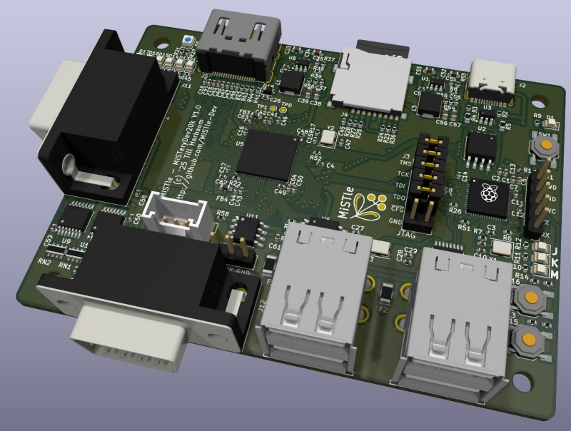

# MiSTeryDev20k

This is a work-in-progress and it will be the first prototype of a
complete custom board which will *not* be needing daughter boards
like the [Tang Nano 20k](https://wiki.sipeed.com/hardware/en/tang/tang-nano-20k/nano-20k.html) or
the [Raspberry Pi Pico](https://www.raspberrypi.com/documentation/microcontrollers/pico-series.html).

The board features the [Gowin GW2AR-LV18QN88C8/I7](https://www.gowinsemi.com/en/product/detail/38/) FPGA present on the
Tang Nano 20k and will run the same cores as that device including the
[NanoMig](http://github.com/MiSTle-Dev/NanoMig) and [MisteryNano](http://github.com/MiSTle-Dev/MiSTeryNano).

This board can be manfactured through [JLCPCBs assembly service](http://jlcpcb.com) using the [production data](production).

The main objective of this board is to run known-good cores and
firmware and test a few features that couldn't be implemented and
tested with the Tang Nano 20k. These include:

  - Use the RP2040 for JTAG programming of the FPGA
  - Additional access to the SD card directly from the RP2040
    - Boot the FPGA from SD card
  - Optionally use the RP2040's native USB via the USB Hub

Further minor changes over the existing boards are:

  - Two DB9 joysticks
  - MIDI on M5 Stack connector

[Schematic PDF](misterydev20k_sch.pdf)
[Layout PDF](misterydev20k_board.pdf)	

## Current state

  - Schematic :heavy_check_mark:
  - Initial PCB layout :heavy_check_mark:
  - LCSC part mapping :heavy_check_mark:
  - BOM verification :heavy_check_mark:
  - Final PCB layout :heavy_check_mark:
  - Prepare JLCPCB [production data](production) :heavy_check_mark:
  - FPGA [stock](https://jlcpcb.com/partdetail/5794058-GW2AR_LV18QN88C8I7/C9900028472) :heavy_check_mark:
  - Order placed :heavy_check_mark:
  - Test :x:
