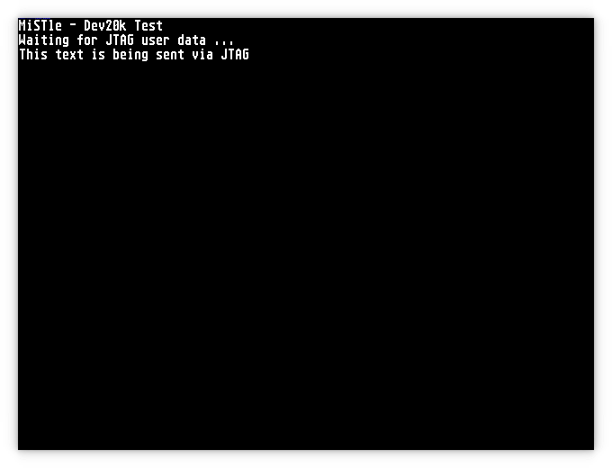

# Dev20k test core

This is a simple test core for the Dev20k board. It will blink with the
RGB and regular LEDs.

The core generates a 640x480@60Hz text video mode via HDMI.



Furthermore, it implements a ```GW_JTAG``` instance which allows the
running core to use the JTAG interface to send and receive data.
Thanks to AMR for [pointing this possibility out](https://retroramblings.net/?p=2042).

This test core accepts text data via JTAG and will display it on
screen, and it will reply with "Ready." via JTAG whenever a newline
character has been received.

The [```jtag.py```](jtag.py) example script can be used to send a
test message from a PC into the running core and to display the reply:

```
$ ./jtag.py 
idcode: 0x0000081b
Sending: This text is being sent via JTAG
Received: Ready.
```
