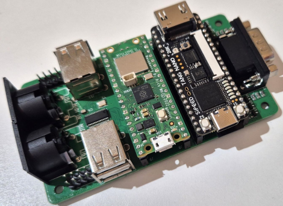
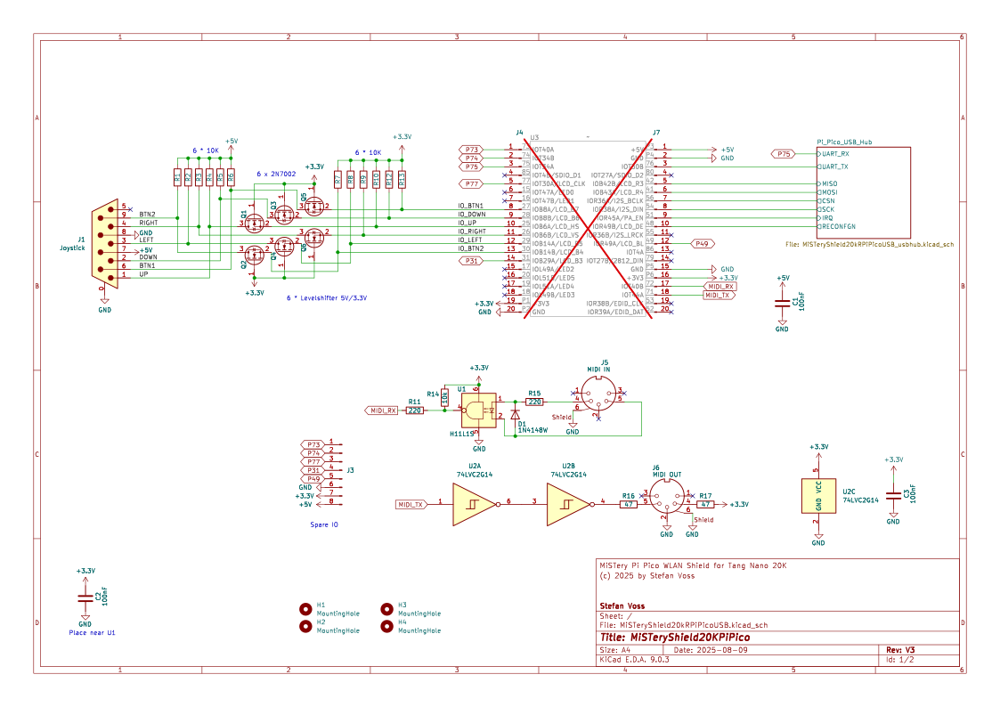
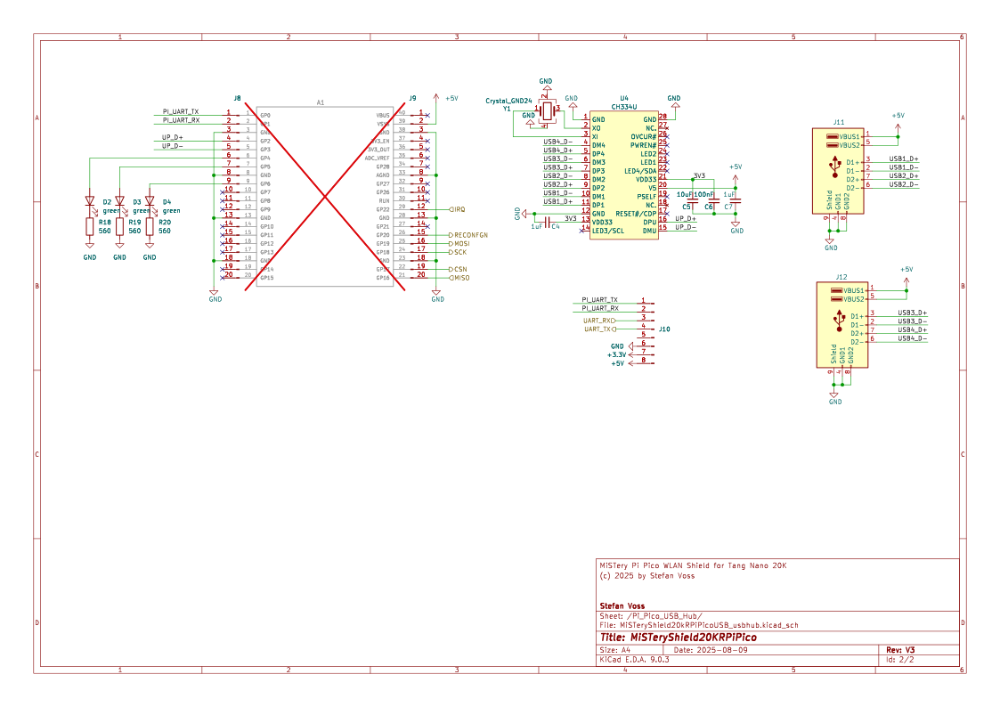
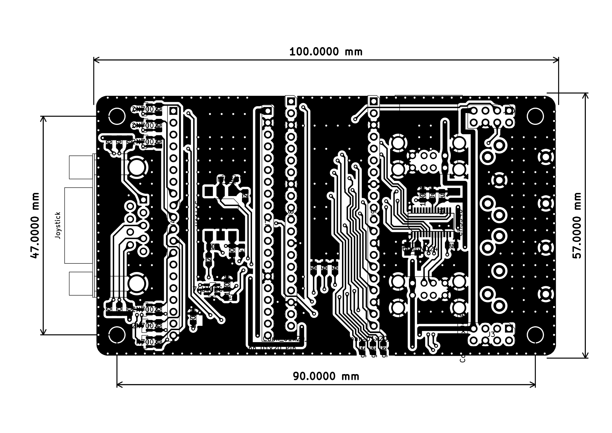

# MiSTeryShield20k RPiPico USB board

Features:

* Headers to plug the Tang Nano 20K
* Headers to plug the [Raspberry Pi Pico (W)](https://www.raspberrypi.com/products/raspberry-pi-pico)
* Atari / Commodore style joystick interface
  * Supports up to two buttons
  * Including 5V supply and 5V level shifters
  * Works with DB9 joystcks and mice
  * MIDI
    * MIDI OUT with driver chip to protect Tang Nano 20K
    * MIDI IN with optocoupler to protect Tang Nano 20K
* 4 x USB-A Interface
* Spare header for FPGA IO / [Dualshock 2 Adapter cable](/board/misteryshield20k_ds2_adapter/misteryshield20k_ds2_adapter_cable.md) (**no DS2 connector onboard**)
* Debug header for Pico UART and e.g. FPGA UART
* 3 x PiPico Status LED
* 3D STEP model to ease case development
* [CERN-OHL-S](https://cern-ohl.web.cern.ch/home) license

PCBA production files for [JLCPCB](https://jlcpcb.com) are availble [here](Output/production)  
(Fully assembled boards can orderd based on BOM partlist, excluding the TN20k and PiPico connector)  

The great PCB Layout work using [KiCad](https://www.kicad.org) had been done by [cantclosevi](https://github.com/cantclosevi). Thx Michal !

**Version history**
|Version| Issue                |Change to earlier version|rework|
|-------|------------          |--------          |---             |
|0      |DS2 connector rotated |engineering sample|mount DS2 bottom|
|1      |mechanical positioning|DS2 rotation fixed|                |
|2      |MIDI IN pin 4+5 reversed|DS2 removed and positioning fixed|[Instruction](rework/REWORK_HW2.MD)|
|3      | none known |MIDI IN fix|-|

  
  
  
  

# Pin usage

| Pin  | Signal | Description            |
|------|--------|------------------------|
| GP0  | UART_TX| Serial debug output    |
| GP1  | UART_RX| Serial debug input     |
| GP2  | USB D+ | USB PIO host D+        |
| GP3  | USB D- | USB PIO host D-        |
| GP4  | LED 1  | indicator mice         |
| GP5  | LED 2  | indicator keyboard     |
| GP6  | LED 3  | indicator joystick     |
| GP16 | MISO   | SPI data from FPGA     |
| GP17 | CSn    | SPI chip select to FPGA|
| GP18 | SCK    | SPI clock to FPGA      |
| GP19 | MOSI   | SPI data to FPGA       |
| GP20 |spare   | spare                  |
| GP22 | IRQn   | SPI interrupt from FPGA|
