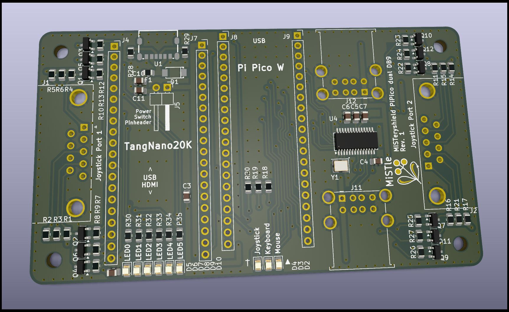
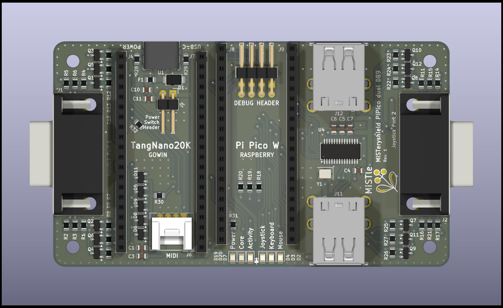
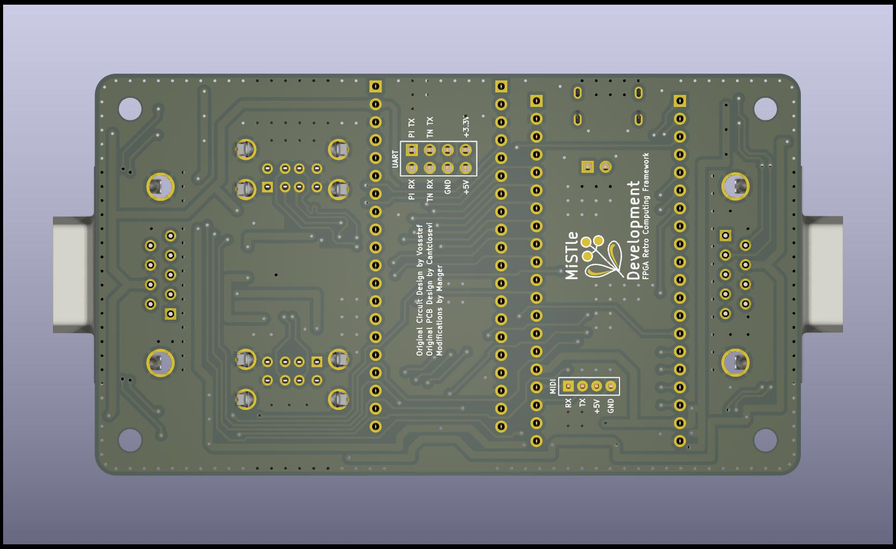
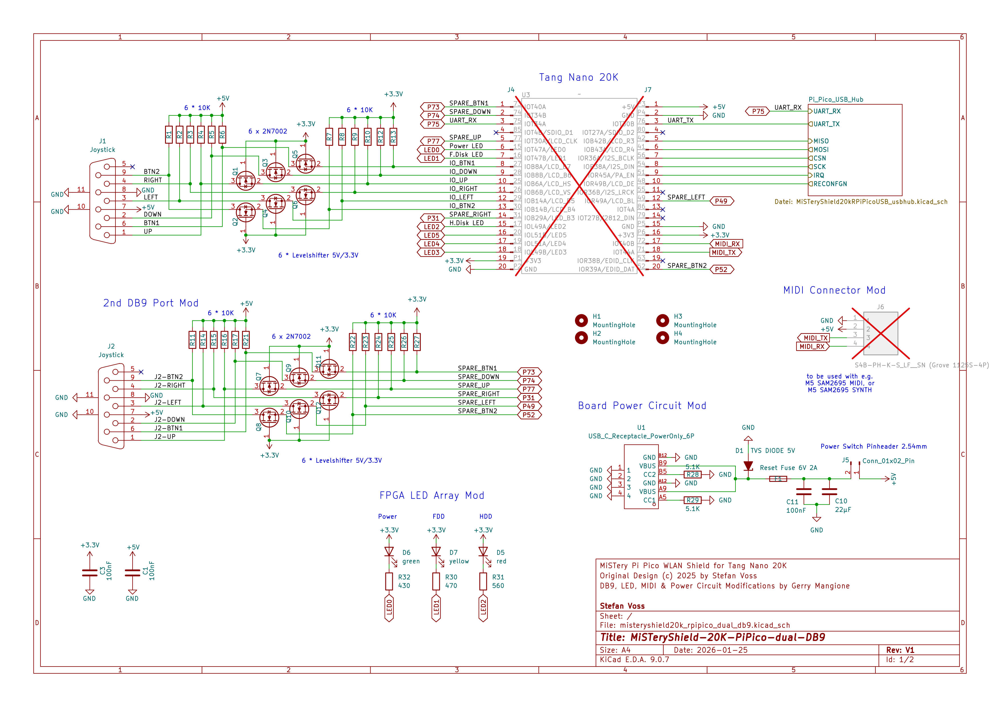
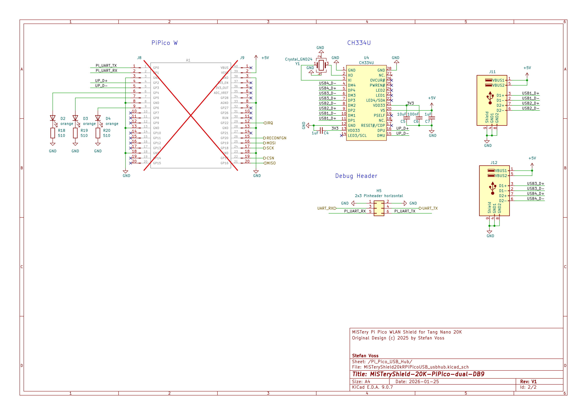
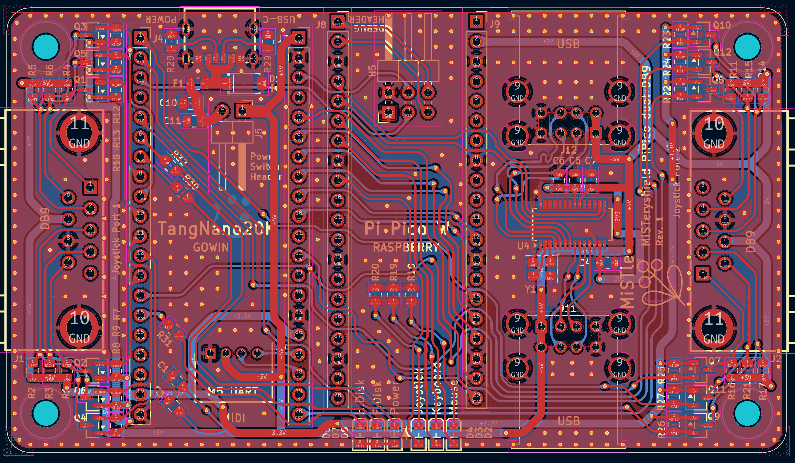
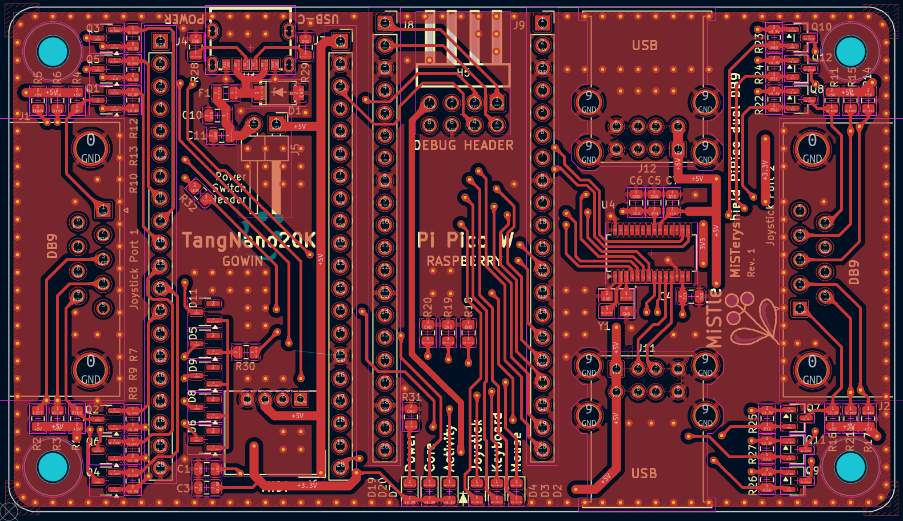
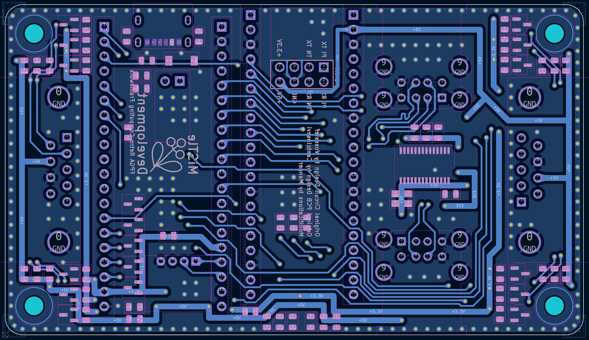

# MiSTeryShield20k RPiPico USB dual DB9 board

The Shield is a Mod of the original **MiSTeryShield20k RPiPico USB board** by Stefan Voss\
With kind permission & support!

**New Features:**

  + 2nd DB9 Joystick port on board
  + on board USB-C power receptacle (incl. fuse and ESD-protection)
  + pin header for case power switch (can be shorted if not needed)
  + Power + Core + Activity LEDs (like on MiST & MiSTer)
  + alternative core loading from USB-C Thumbstick (by Stefan Voss)
  + debug header optional (not populated)
  + MIDI optional on M5 Stack connector to be used with  
    e.g. M5 SAM2695 MIDI, or M5 SAM2695 SYNTH

**Features removed:**

  - no spare pin header (the spare pins are used for the 2nd DB9 port)
  - MIDI circuit and DIN connectors (replaced by an external solution)

**Features from the original design:**

- Headers to plug the Tang Nano 20K
- Headers to plug the Raspberry Pi Pico (W)
- Atari / Commodore style joystick interface
- Supports up to two buttons
- Including 5V supply and 5V level shifters
- Works with DB9 joystcks and mice
- MIDI
- 4 x USB-A Interface
- Debug header for Pico UART and e.g. FPGA UART
- 3 x PiPico Status LED (KBD/MOUSE/JOY)
- 3D STEP model to ease case development

**The 2nd DB9 port ist supported by:**

+ MiSTeryNano
+ C64 Nano
+ NanoMig

other cores may follow...

## THE SHIELD IS A WORK IN PROGRESS! NOT READY YET!

[Review Notes](Review_Notes.md)

 

**TO DO**

- Schematic Review
- PCB Review
- BOM check
- Preparation of production data
- Order placement
- Shipping
- Arrival
- Testing

**Credits**

Original Circuit Design by Vossstef\
Original PCB Design by Cantclosevi\
Modifications by Manger

**MIDI - optional on M5 Stack connector to be used with e.g. M5 SAM2695 MIDI, or M5 SAM2695 SYNTH)**

