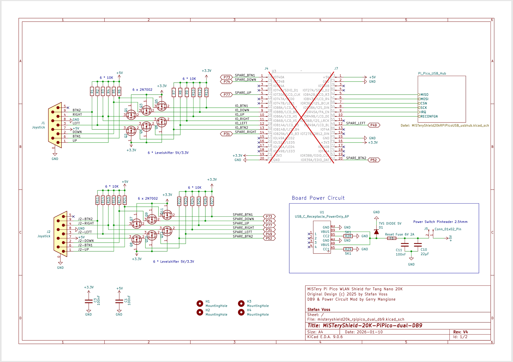
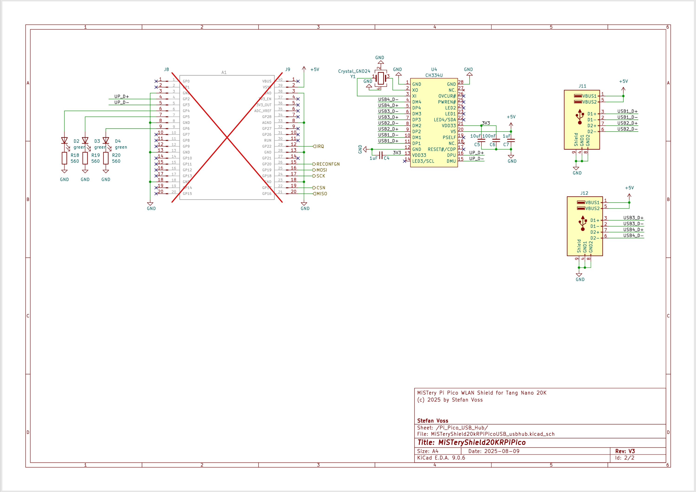

# MiSTeryShield20k RPiPico USB dual DB9 board

The Shield is a Mod of the original **MiSTeryShield20k RPiPico USB board** by Stefan Voss\
With kind permission & support!

**New Features:**

  + 2 DB9 Joystick ports on board
  + on board USB-C power receptacle
  + pin header for case power switch

**Features removed:**

  - no MIDI ports (might not be relevant for all users)
  - no spare pin header (the spare pins are used for the 2nd DB9 port)
  - no debug header

**The 2nd DB9 port ist supported by:**

+ MiSTeryNano
+ C64 Nano
+ NanoMig

other cores may follow...

**THE SHIELD IS A WORK IN PROGRESS!
NOT READY YET!**

**TO DO**

- Schematic
- PCB layout
- Preparation of production data
- Order placement
- Shipping
- Arrival
- Testing

PCB in KiCanvas: https://kicanvas.org/?repo=https%3A%2F%2Fgithub.com%2FMiSTle-Dev%2FBoards%2Fblob%2Feed25b104954b580e4da3eaffa35d38c1b20c265%2Fmisteryshield20k_rpipico_dual_db9%2Fmisteryshield20k_rpipico_dual_db9.kicad_pcb
