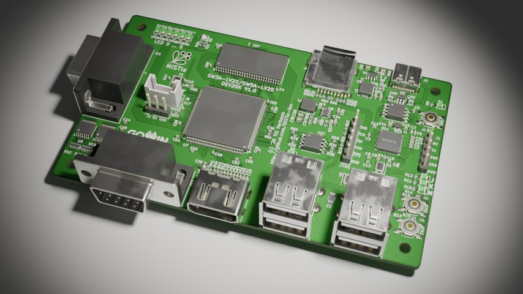

# GW3A-LV20 MiSTle development board

This board is derived from the [MiSTeryDev20k
board](https://github.com/MiSTle-Dev/Boards/tree/main/misterydev20k)
which was the first full custom board designed for the MiSTle project.

This board is a development board to test the upcoming
[GW3A-LV20 FPGA](https://www.gowinsemi.com/en/product/detail/84/) with
the MiSTle retro computing cores. The NanoMig has already [been
prepared](https://github.com/MiSTle-Dev/NanoMig/tree/main/src/mistle/gw3a_20)
to ensure that the cores can be synthesized and especially to verify
the pin mapping.

## Goals
  - Get used to the new GW3A family of FPGAs
    - Update openFPGAloader
    - Verify use of external SDRAM
  - Update Companion to RP2350
    - Use additional PIO for JTAG

## Current state

  - Initial schematic and board derived from the [MiSTeryDev20k board](https://github.com/MiSTle-Dev/Boards/tree/main/misterydev20k)
  - [NanoMig](https://github.com/MiSTle-Dev/NanoMig) core [synthesized for GW3A-LV20](https://github.com/MiSTle-Dev/NanoMig/tree/main/src/mistle/gw3a_20) :heavy_check_mark:
    - LUT usage around 80%
  - Schematic updates
    - GW2AR-LV18 FPGA replaced by GW3A-LV20 :heavy_check_mark:
    - Updated pin mapping :heavy_check_mark:
    - Added external 256MBit (16M*16) SDRAM as the GW3A-LV20 has no internal SDRAM :heavy_check_mark: 
    - External peripherals mapped :heavy_check_mark:
    - Update FPGA Power Supply :heavy_check_mark:
    - Add smoothing capacitors and similar :heavy_check_mark:
    - Initial routing :heavy_check_mark:
    - Verify schematic :wrench:
       - Check updated SD card wiring :heavy_check_mark:
       - Check FPGA power supply :heavy_check_mark:
       - Update from rp2040 to rp2350 :heavy_check_mark:
       - Check compatibility with GW5A-LV25-LQ144 :heavy_check_mark:
    - Verify PCB :wrench:
    - Update JLCPCB part numbers :heavy_check_mark:
    - Generate [JLCPCB production data](production) :heavy_check_mark:
    - Order partially assembled boards :heavy_check_mark:
    - Order FPGAs :heavy_check_mark:	
    - Waiting for delivery :wrench:
    - Update Companion firmware for rp2350
    - Solder and test FPGA
    - Solder and test SDRAM

## Preliminary schematic

The schematic is a work in progress and can be viewed [here](https://github.com/MiSTle-Dev/Boards/blob/main/mistle_gw3a_20/mistle_gw3a_20_sch.pdf).
