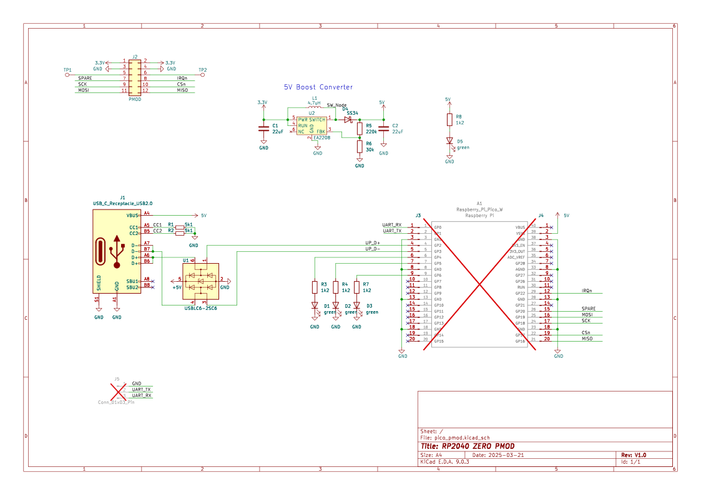
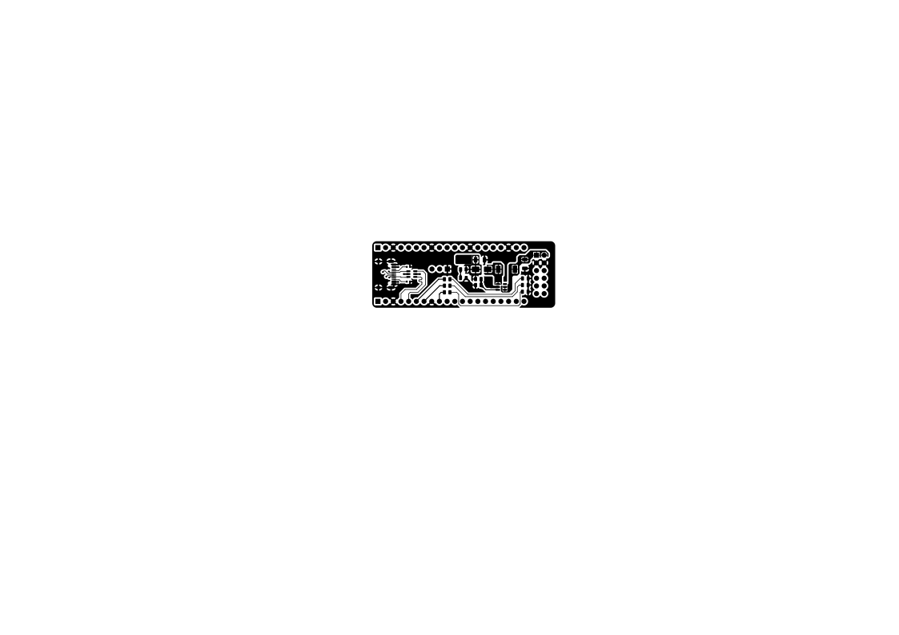

# PMOD PiPico W

Features:
* PMOD carrier for a [Raspberry Pi Pico W](https://www.raspberrypi.com/documentation/microcontrollers/pico-series.html)
* USB-C to e.g. USB-C HUB or HID dongle
* Debug header for Pico UART
* PMOD spare signals on Testpoints
* Status LED's
* [CERN-OHL-S](https://cern-ohl.web.cern.ch/home) license

PCBA production files for [JLCPCB](https://jlcpcb.com) are availble [here](production).  
(Fully assembled boards can orderd based on BOM partlist, excluding the RP2040)  

  
  
  

| Pin | Signal | Description |
|---|---|---|
| GP0  | UART_TX  | Serial debug output |
| GP1  | UART_RX  | Serial debug input |
| GP2  | USB D+ | USB PIO host D+ |
| GP3  | USB D- | USB PIO host D- |
| GP4  | LED 1 | indicator mouse |
| GP5  | LED 2 | indicator keyboard |
| GP6  | LED 3 | indicator joystick |
| GP16 | MISO | SPI data from FPGA |
| GP17 | CSn | SPI chip select to FPGA |
| GP18 | SCK | SPI clock to FPGA |
| GP19 | MOSI | SPI data to FPGA |
| GP22 | IRQn | SPI interrupt from FPGA |